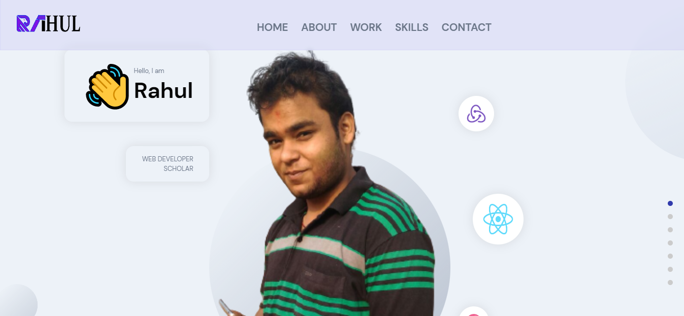
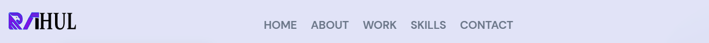
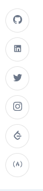
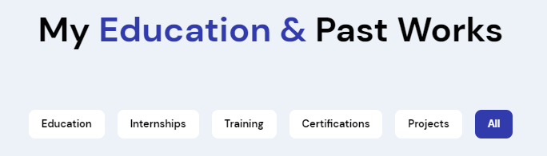
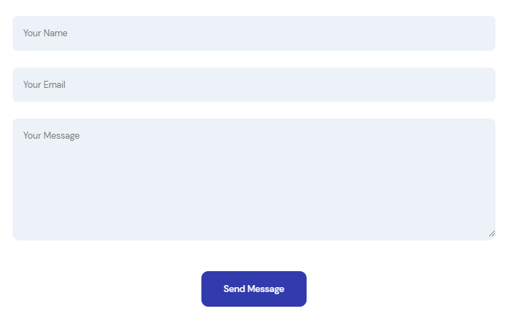

# Portfolio
My portfolio website react + sass  backend@ https://rahul8709portfolio.sanity.studio/desk
Please visit the link : https://rahul8709-portfolio.netlify.app/

# Look

  

# Introduction

- Build a personal portfolio website, which tells everyone about my accomplishments and education ,it basically makes my presence in todays virtual world.
- The frontend of this webapp is built using `React js` ,`framer-motion` and `sass`.
- It is fetching data from a backend built on `sanity`.
- This website is easily managable and upgradable, without any use of coding, via `sanity-studio`.

# Functionalities

  

- It has a navbar at the top with buttons which scroll you to different sections of the page.

  
   

- As you can see above,  Higher-Order-Components are also implemented in this webapp  at two  instances, firstly it has 6-social media buttons which redirect you to my respective handle and, another one are the navigation-dots.

  

- It shows all of my education,internships, projects, etc in a sorted manner.
- With each card when you hover on it , two buttons appear of `eye` and `github` ,which has folowing funcionalities. 
- eye: If you want to see the deployed version of the project , or `certificates` in the case of education and training or internship, it will redirect you. 
- github: If you want to see the code of that project, this button wont redirect you in case of education or internships. 

  

- It has a form which you can fill and after clicking on send message the response will be reflected on my database.

# credits

- RAHUL MISHRA (https://github.com/rahul87911)
- Thank You for visiting here.

